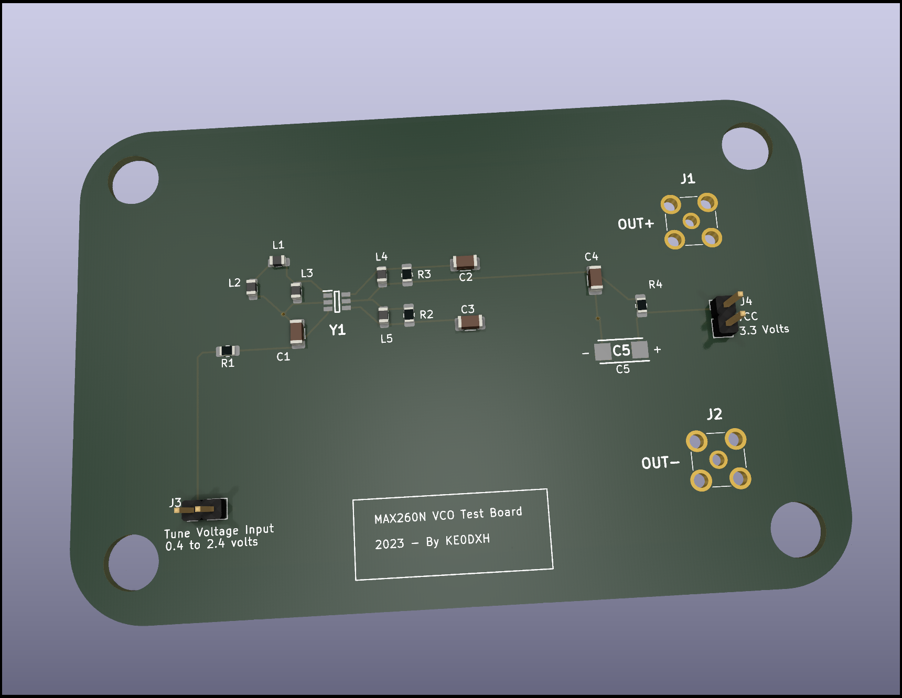

# MAX2607 (Voltage Controlled Oscillator) Test Board.

this is an open source schemaatic and board layout for the [MAX2607 VCO](https://www.analog.com/en/products/max2607.html).

Analog Devices is selling their eval boards for over $200 USD, and the part itself is
just a couple of bucks. I'm just getting started desiging my own hardware,
so I figured I might as well practice my board design skills. I simply copied
The [eval board design taken from the Analog Devices website](
https://www.analog.com/media/en/technical-documentation/data-sheets/MAX2605EVKIT-MAX2609EVKIT.pdf).
I included placeholders for all of the resistors and inductors called out in that design,
so this board should work for testing all versions of the chip from the MAX2605
to the MAX2609.

I ordered 5 of these from [JLCPCB](https://jlcpcb.com). It was a very simple
process. I simply took the contents of the [gerbers folder](./gerbers), zipped
them up and uploaded the zipfile, and for $40 USD (including shipping), and about
2 weeks, I have a set of boards.

The version of the boards I ordered was commit 27e65ae6c2ac64e3f9bb4, which I later
noticed had a few things missing from the silkscreen, and I forgot to do the
mounting holes. I fixed those things, and that is the main HEAD commit.

So for about $12 USD total per board (board and parts), I now have 5 of these test boards.

If these devices pan out, I may use them in some future designs I am thinking through.

